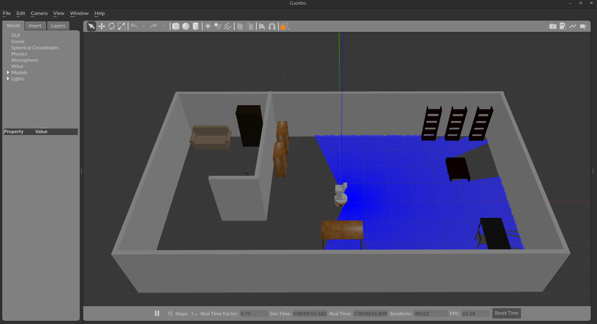
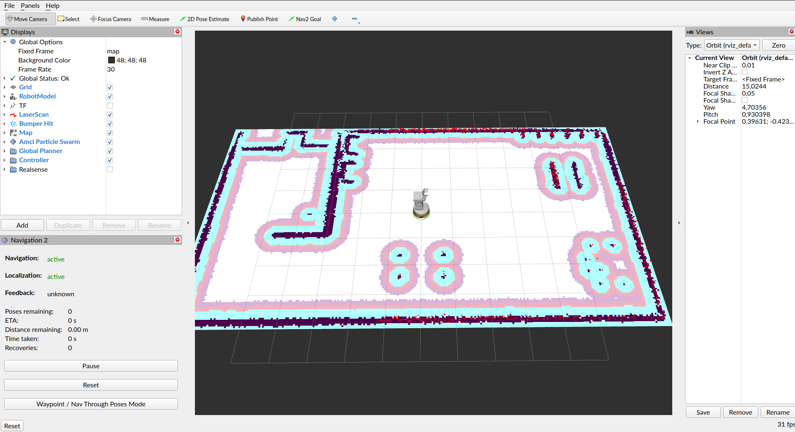
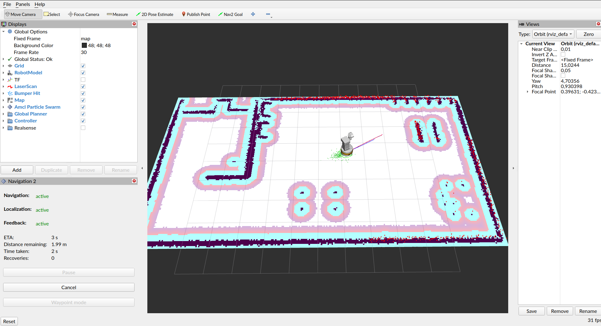

# TIAGo Robot Simulation using ROS2 Humble

This repository consists of packages that enables TIAGo robot simulation in ROS2 with navigation provided by Nav2 package. It utilizes [packages](https://github.com/pal-robotics) created by PAL Robotics company.

## Getting Started
### Prerequisites
1. Install ROS 2 Humble - [installation instructions](https://docs.ros.org/en/humble/Installation/Ubuntu-Install-Debians.html).
2. Install Nav2 - [installation instructions](https://docs.nav2.org/getting_started/index.html#installation).
3. Update the apt package and install required packages

```console
sudo apt-get update
sudo apt-get install git python3-vcstool python3-rosdep python3-colcon-common-extensions
```
### Create the workspace
Create your workspace and clone this repository:

```console
mkdir -p ~/rico_ros2_ws/src
cd ~/rico_ros2_ws/src
git clone https://github.com/RCPRG-ros-pkg/rico_sim_2.git .
```

### Install dependencies
```console
sudo rosdep init
rosdep update
rosdep install --from-paths src -y --ignore-src
```

### Source and build
```console
source /opt/ros/humble/setup.bash
colcon build --symlink-install
```

> **Warning**: If your system crashes during building, try limiting the maximum number of jobs to process in paralell. E.g `colcon build --symlink-install --parallel-workers 2`

### Source the workspace
```console
cd ~/rico_ros2_ws
source install/setup.bash
```

## Running simulation
Simulation launch and config files are located inside `tiago_simulation_bringup` package. 
To run the default simultion, execute the following code:

```console
ros2 launch tiago_simulation_bringup system_bringup.launch.py arm:=no-arm
```

You should see Gazebo and Rviz window:



You should be able to interact with the robot and Nav2 by setting the Nav2 Goal in Rviz:


## Customizing your simulation
You cam easily customize your simulation by editing config files within `tiago_simulation_bringup` package.
`global_config.yaml` file enables you to select your own world, map and choose whether to use different tools:
```yaml
global_config:
  ros__parameters:
    world_name: 'W_1'            # Localization: pal_gazebo_worlds package
    map_name: 'W1_map.yaml'      # Localization: tiago_simulation_bringup package
    use_navigation: 'true'
    use_moveit: 'false'
    use_slam: 'false'
    use_rviz: 'true'
```
### Adding your own worlds
In order to maintain the project structure, Gazebo world files are stored inside `pal_gazebo_worlds` package inside `worlds` directory.
You can add your own worls there and access them in simulation by changing world_name parameter in `global_config.yaml` file.

### Adding your own maps
Maps are stored inside `tiago_simulation_bringup` package in `map` directory. You can add your own maps there and access them in simulation by changing map_name parameter in `global_config.yaml` file.

### Configuring navigation parameters
You can change nagigation parameters used by Nav2 package. The whole configuration is stored inside `tiago_simulation_bringup` package in `tiago_nav2.yaml` file.